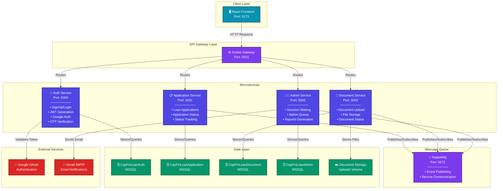
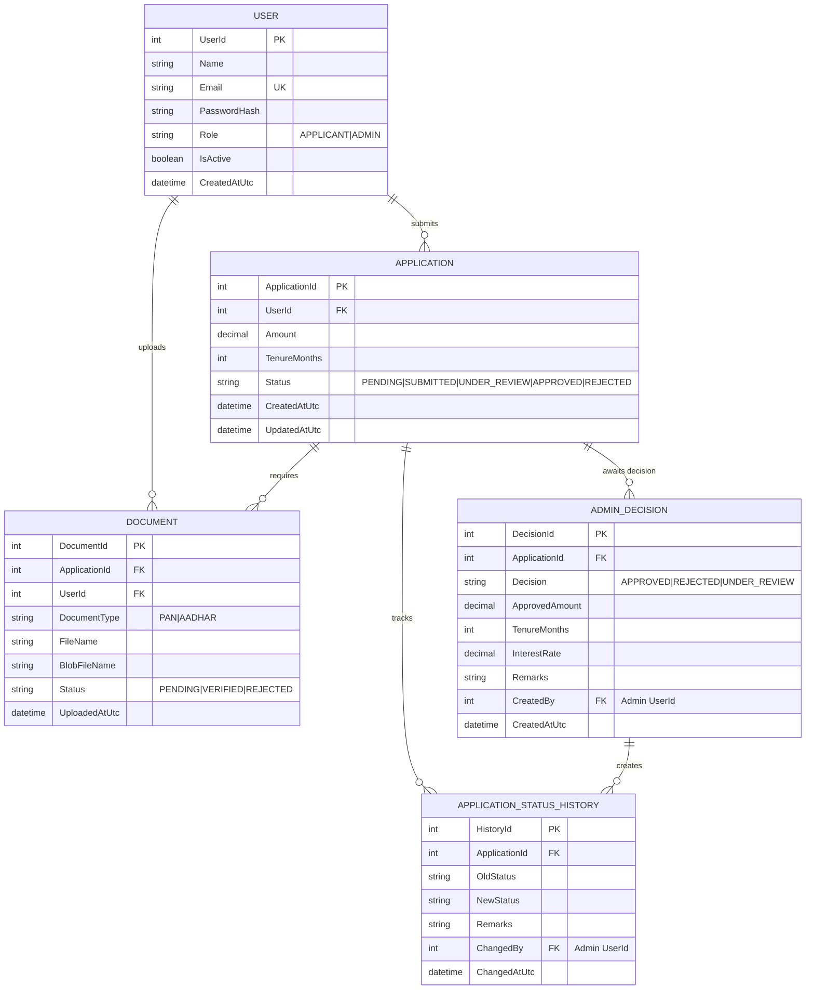
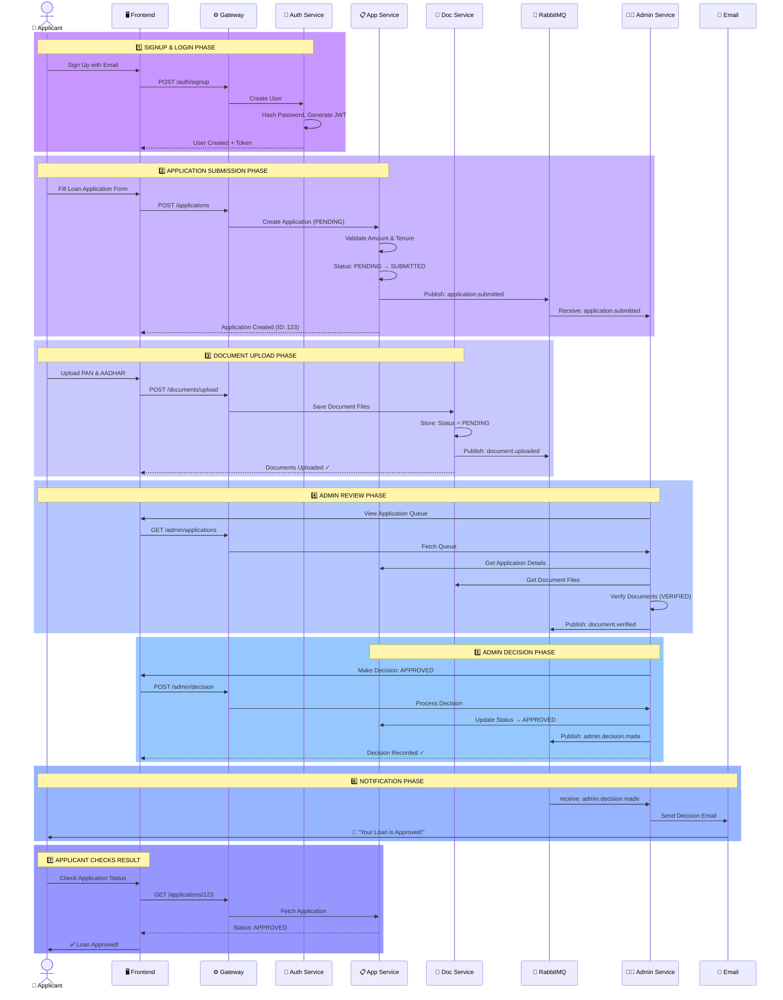
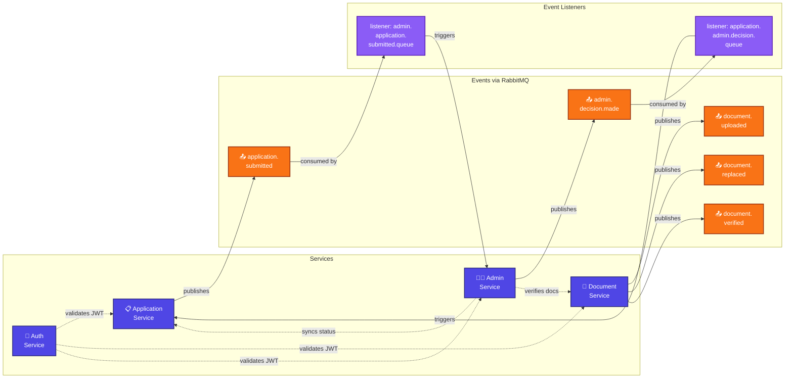

# CapFinLoan System Architecture Diagrams

This document contains all the UML diagrams for the CapFinLoan microservices project.

---

## 1. System Architecture Diagram



---

## 2. Database Entity Relationship Diagram (ERD)



---

## 3. User Journey - Loan Application Flow (Sequence Diagram)



---

## 4. Event-Driven Architecture & Service Communication



---

## Export Instructions

To export these diagrams as PNG images:

### Option 1: Using Mermaid Live Editor

1. Visit https://mermaid.live
2. Copy any diagram code from above
3. Paste into the editor
4. Click "Download" → Select PNG format

### Option 2: Using VS Code

1. Install "Markdown Preview Mermaid Support" extension
2. Open this file in VS Code
3. Preview the markdown
4. Right-click on diagram → Save as PNG

### Option 3: Command Line (Linux/Mac)

```bash
npm install -g @mermaid-js/mermaid-cli
mmdc -i architecture.mmd -o architecture.png
```

---

## Key Components Summary

| Component            | Port | Purpose                     |
| -------------------- | ---- | --------------------------- |
| React Frontend       | 5173 | User interface              |
| API Gateway (Ocelot) | 5021 | Route requests to services  |
| Auth Service         | 5000 | User authentication & JWT   |
| Application Service  | 5001 | Loan application management |
| Document Service     | 5002 | Document upload & storage   |
| Admin Service        | 5003 | Admin decisions & approvals |
| RabbitMQ             | 5672 | Event messaging & pub-sub   |
| MSSQL Databases      | 1433 | Data persistence (4 DBs)    |

---

**Created:** April 16, 2026  
**Project:** CapFinLoan Microservices Platform
